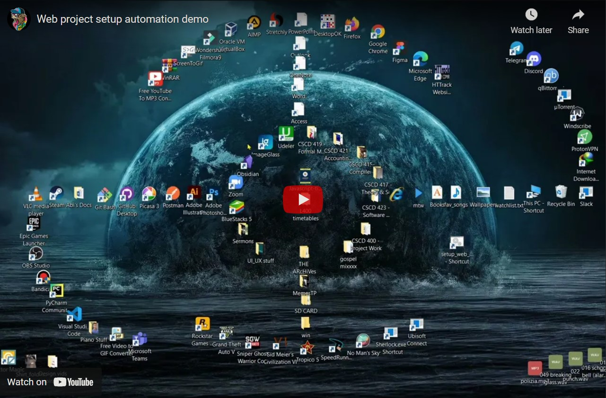

# Web_project_setup_script

This is a small script I put together to set up my workflow when starting frontend projects. I got tired of clicking on the same buttons and typing the same things every time I turn on my PC to work. 

 

## Process
The script is launched with a `.bat` file in the root directory (if you want to have it out of the root directory for convenience, create a shortcut of the `.bat` file to run it wherever on your PC). It then makes use of keyboard shortcuts extensively to switch desktops and open the desired programs. Folders are opened using the windows run dialog (I really enjoy using the run dialog to open stuff) by creating shortcuts of the target folders and  placing them in `C:\Users\yourUsername`. They can then be renamed to something you can remember and will open the target folder once you type the name of the shortcut in the windows run dialog as shown in the demo. The automation library takes it from there.

 

## Demo

      
    

 

## Built with

- NodeJS
- [Nut.js desktop automation library](https://github.com/nut-tree/nut.js)
- [Node-notifier](https://github.com/mikaelbr/node-notifier) for desktop notifications

 

## Disclaimer
Do not run the `example.bat` file as it is just an example, rather open it in your code editor and edit the code to suit your workflow. In case you need to brush up on some batch script, [I got you](https://www.tutorialspoint.com/batch_script/index.htm). Also, not sure this will work on mac🙂 as it uses screenshots of app components from Windows in order for the library to locate and click on things.
